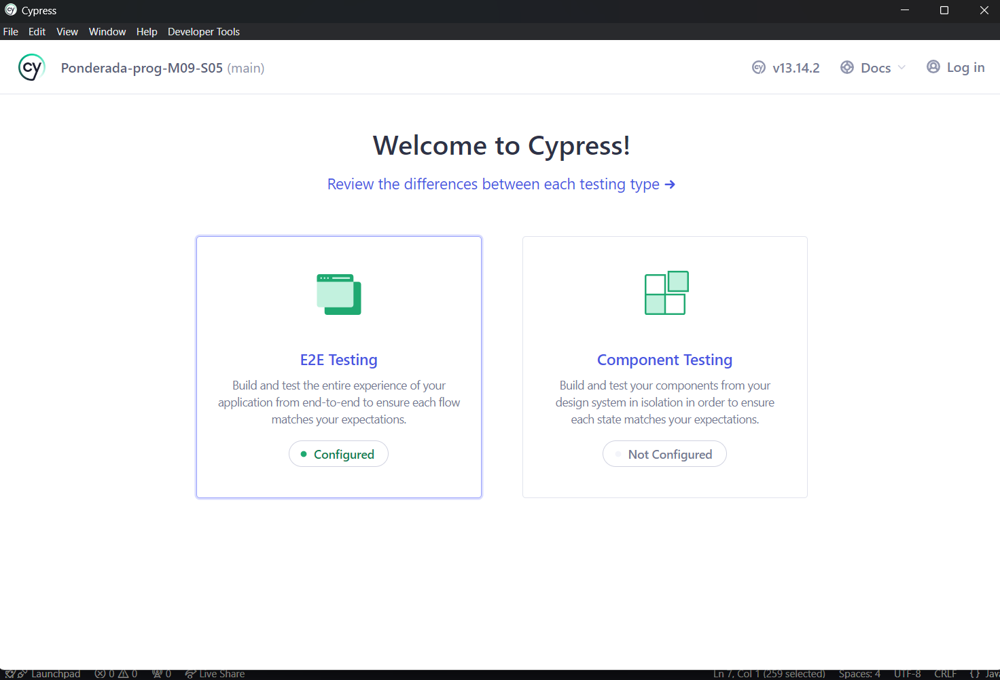
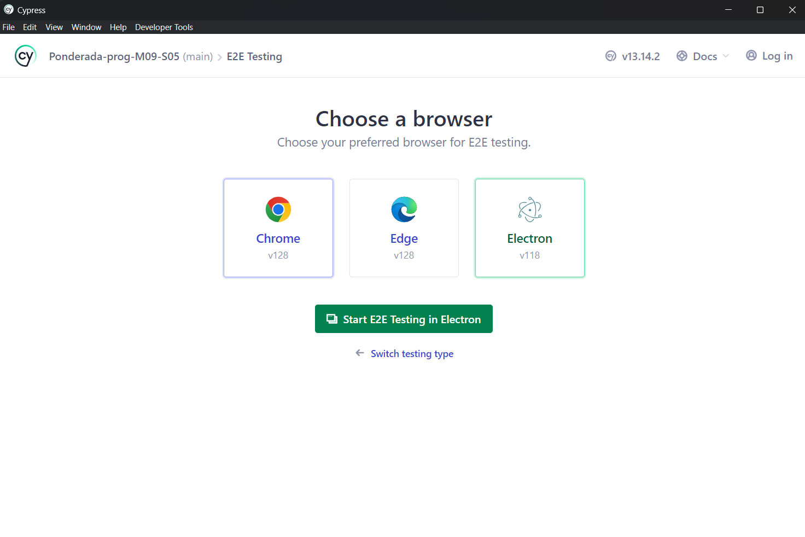
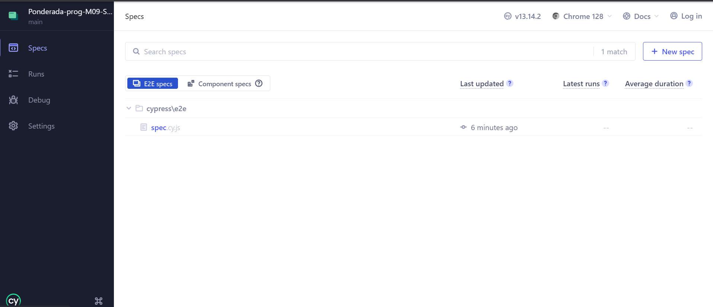
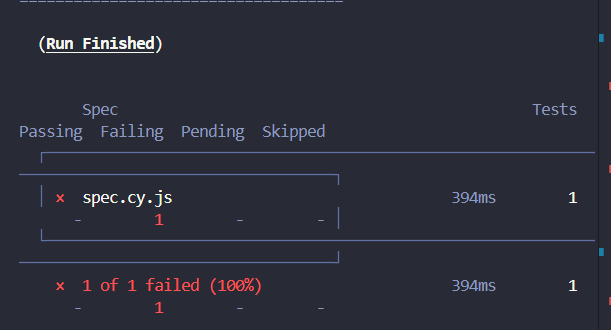
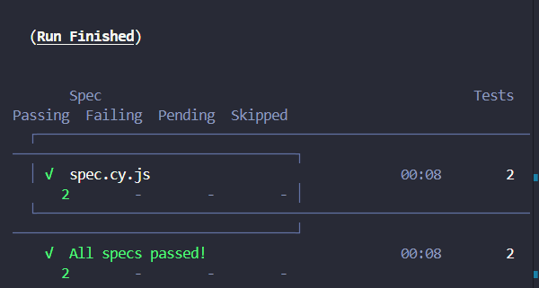
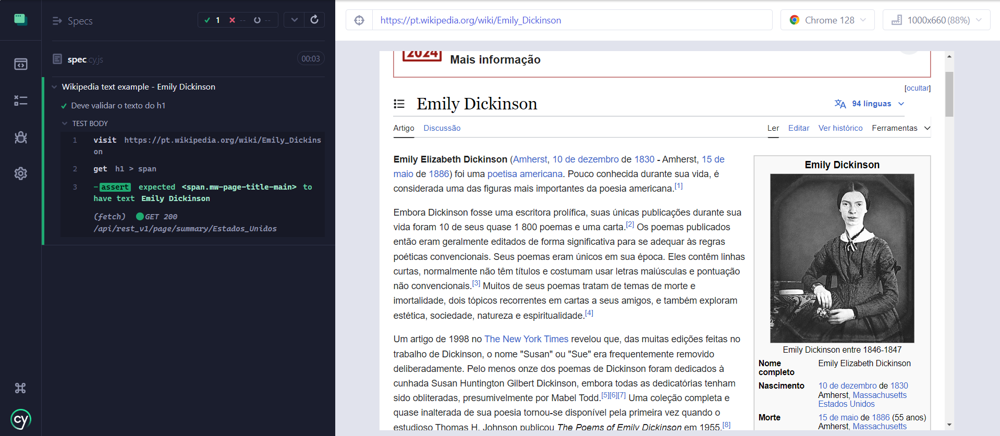

## Teste Automatizado com Cypress utilizando TDD

### Introdução
Nesta atividade, o objetivo era seguir o tutorial How to Test React Using Cypress para criar meu primeiro teste automatizado utilizando Cypress. Adicionalmente, foi aplicada a metodologia de desenvolvimento orientado a testes (TDD) para construir o teste.

### Tutorial para Setup

Seguinte o tutorial do link:
https://www.browserstack.com/guide/how-to-test-react-using-cypress

Começamos com a instalação do Cypress usando o comando:

```
npm install Cypress -- salvar - dev
```

Em seguida abrimos o Cypress para configuração inicial com o comando:
```
npx cipreste aberto
```
Então seremos direcionamos para a escolha do tipo de teste, nesse caso, usaremos o end to end:



Logo após escolhemos o navegador onde o Cypress será aberto, no nosso caso, usaremos o Chrome:



Com isso, somos direcionados para a janela de specs, onde podemos criar a nossa e assim começar a testar e entender na prática como o Cypress funciona:



### Metodologia TDD

Para os testes vamos utilizar a metodologia TDD que segue um ciclo de três passos principais:

**Red:** Escrever um teste que inicialmente falha.
**Green:** Escrever o código mínimo necessário para passar o teste.
**Refactor:** Refatorar o código para melhorar sua estrutura, mantendo o teste passando.

Começando os testes:

**Passo 1: Red** - Escrevendo um Teste que Vai Falhar
Vamos criar um teste que espera que exista uma função chamada ```getWikipediaTitle```, que retorne o texto do título da página da Wikipedia. Como ainda não implementamos essa função, o teste deve falhar.

```javascript
describe('Wikipedia function example - Emily Dickinson', () => {
    it('Deve falhar porque a função getWikipediaTitle não está implementada', () => {
        // Aqui estamos esperando que a função exista e retorne o título "Emily Dickinson"
        cy.visit('https://pt.wikipedia.org/wiki/Emily_Dickinson');
        const title = getWikipediaTitle(); // Função não implementada
        expect(title).to.equal('Emily Dickinson');
    });
});
```


**Resultado:** O teste falhará porque a função ```getWikipediaTitle``` não está definida.



**Passo 2: Green** - Implementando a Função Básica para Passar o Teste
Agora, vamos implementar uma função básica chamada  ```getWikipediaTitle``` que simplesmente retorna o texto correto. Isso fará com que o teste passe.

```javascript
function getWikipediaTitle() {
    return 'Emily Dickinson'; // Função básica para passar o teste
}

describe('Wikipedia function example - Emily Dickinson', () => {
    it('Deve passar ao validar o título usando a função getWikipediaTitle', () => {
        cy.visit('https://pt.wikipedia.org/wiki/Emily_Dickinson');
        const title = getWikipediaTitle();
        expect(title).to.equal('Emily Dickinson');
    });
});
```


**Resultado:** O teste agora passará, pois a função ```getWikipediaTitle``` retorna o texto esperado "Emily Dickinson".



**Passo 3: Refactor** - Melhorando o Código
Agora que o teste está passando, podemos refatorar a função para torná-la mais dinâmica, por exemplo, para que ela realmente extraia o título da página ao invés de retornar um valor fixo. No entanto, isso já é um avanço para a refatoração e melhorias subsequentes.

```javascript
function getWikipediaTitle() {
    return cy.get('h1 > span').invoke('text'); // Extrai o texto do título diretamente da página
}

describe('Wikipedia function example - Emily Dickinson', () => {
    it('Deve passar ao validar o título usando a função getWikipediaTitle', () => {
        cy.visit('https://pt.wikipedia.org/wiki/Emily_Dickinson');
        getWikipediaTitle().then((title) => {
            expect(title).to.equal('Emily Dickinson');
        });
    });
});
```

**Resultado:** O teste continua a passar, mas agora a função  ```getWikipediaTitle``` é mais útil e dinâmica, extraindo o título diretamente da página da Wikipedia.



### Conclusão

Aplicando o ciclo TDD (Red, Green, Refactor) a este simples teste com Cypress, foi possível garantir que cada etapa do desenvolvimento fosse verificada por meio de testes automatizados. Este processo assegurou que o código não só fosse funcional, mas também estivesse bem estruturado e preparado para futuras expansões.